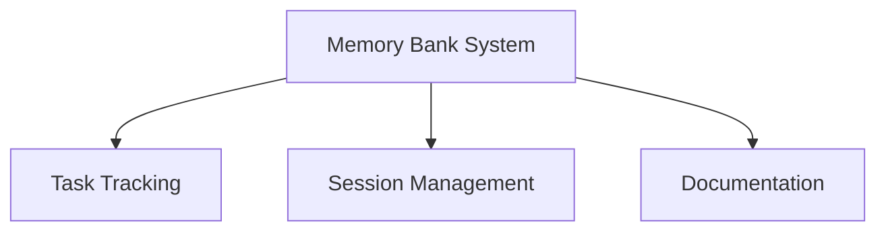

# Component Index
*Last Updated: 2025-04-24*

## Core Components

### Memory Bank System
- Location: `/memory-bank/`
- Status: 🔄 Initializing
- Dependencies: None
- Files:
  - tasks.md
  - session_cache.md
  - edit_history.md
  - errorLog.md
  - progress.md
  - projectbrief.md
  - changelog.md
  - component_index.md

### Project Components
To be added as components are developed.

## Component Relationships

## Notes
Initial component structure being established during project setup.